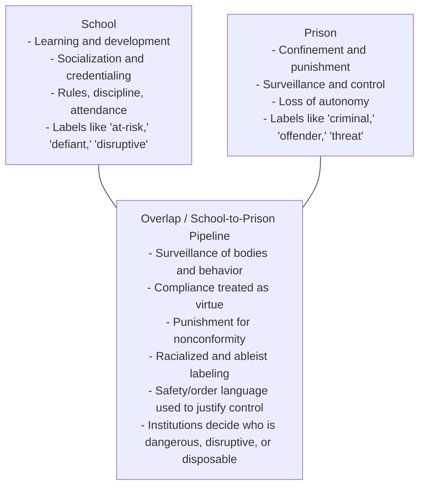

# EDU 442 Week 8 Reading Prep

## March 16, 2026
**Topic:** School-to-prison pipeline

This sheet gives you one quote, why it matters, plus comments and discussion questions for each reading. Quotes are kept short and should be checked against your course copies if you plan to cite them in writing.

---

## James-Gallaway (2022)
**Reading:** “The Kids in Prison Program”

**Quote**  
“disciplinary and surveillance practices used to control Black students’ bodies”

**Why this matters**  
This line gets at the core of the article: the problem is not just “strict discipline,” but a racialized system of control. The article asks us to see discipline as governance over Black students’ bodies, movement, and self-expression rather than as neutral classroom management.

**Comments**
- This framing makes No Excuses discipline feel less like a school culture issue and more like a carceral logic inside education.
- It helps explain why “good student” often gets defined as quiet, compliant, and easy to manage.
- The article is useful for thinking about how surveillance in schools gets justified as structure, safety, or high expectations.

**Questions**
- At what point does school “structure” become dehumanizing control?
- How do race and disability intersect when behavior is read as defiance or noncompliance?
- What would a classroom look like if dignity mattered more than obedience?

---

## Marsh (2017)
**Reading:** “Becoming restorative: Three schools transitioning to a restorative practices culture”

**Quote**  
“At its core, transitioning to a RP approach requires a school’s deep culture to change.”

**Why this matters**  
This is Marsh’s main argument in one sentence. Restorative practices are not just a strategy or add-on program. If the school still thinks punitively, restorative language can be absorbed into the same old system instead of changing it.

**Comments**
- Marsh is warning against shallow implementation.
- The article suggests that relationships, adult behavior, trust, and time matter more than branding something “restorative.”
- This is a helpful counterpoint to schools that measure success only by fewer referrals rather than deeper relational change.

**Questions**
- What evidence would show that a school is actually becoming restorative?
- Can restorative practices work in a school that still depends on exclusion, surveillance, or police presence?
- What adult habits or institutional assumptions have to change first?

---

## Stevenson (2021)
**Reading:** “Punishment” in *The 1619 Project*

**Quote**  
“a presumption of danger and criminality still follows black people everywhere”

**Why this matters**  
This quote captures Stevenson’s historical argument clearly: punishment in the United States is racialized, and Black people continue to be approached through suspicion and presumed threat. It helps explain why punishment can appear normal, administrative, or deserved even when it is deeply unequal.

**Comments**
- Stevenson gives the historical foundation for the school-to-prison pipeline.
- He pushes us to question whether systems like discipline, policing, and incarceration are really separate from the history of slavery.
- This reading makes it harder to treat school discipline data as neutral fact rather than something produced inside a racialized punishment system.

**Questions**
- If criminality is socially attached to Blackness, how do school discipline systems inherit that logic?
- What does this mean for “objective” school data like referrals, suspensions, and behavior reports?
- How should educators respond if institutions reward order more than justice?

---

## Big Picture Connection
- Stevenson explains the historical structure of punishment.
- James-Gallaway shows how that structure appears inside schools through discipline and surveillance.
- Marsh shows that alternatives require institutional and cultural change, not just new language or programs.

**One synthesis line for class**  
These readings together argue that punishment in schools is not just about managing behavior; it is part of a broader racialized system, and meaningful alternatives require changing the culture and power relations of institutions, not just their vocabulary.

## Venn Diagram: School and Prison

